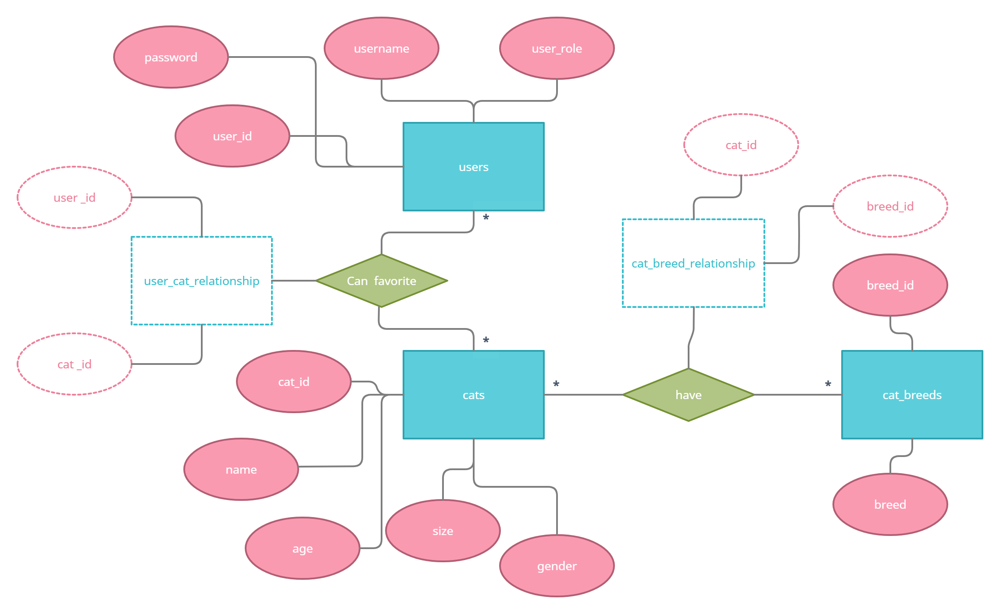

# Projektplan

## 1. Projektbeskrivning (Beskriv vad sidan ska kunna göra).
Jag har valt att göra en hemsida för adoption av katter. Det är tänkt att sidan ska ägas av ett shelter för hemlösa katter och kunna besökas av folk som är intresserade av att adoptera katterna. Sheltret som äger sidan har admin rättigheter och kan lägga ut annonser på sina katter, som inloggade användare sedan kan kolla på och "gilla". Användare kan spara favorit-katter i sin profil, och hitta kontaktuppgifter till sheltret via sidan. Det är även tänkt att man ska kunna filtrera katter på kön, ålder, ras och vikt, och kunna söka efter katter m.h.a. deras namn. 

## 2. Vyer (visa bildskisser på dina sidor).
Alla sidor

Förstasidan 

Användarprofil

Användares favorit annonser

Admins profil 

Skapa katt-annons sidan (endast admin)

## 3. Databas med ER-diagram (Bild på ER-diagram).

## 4. Arkitektur (Beskriv filer och mappar - vad gör/innehåller de?).

